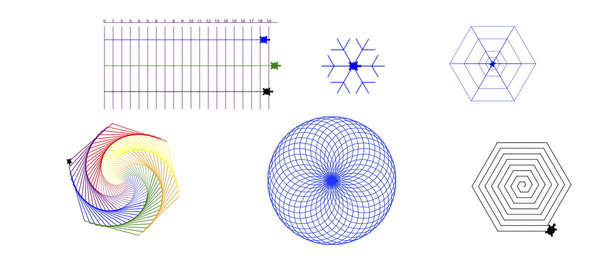

# Python Turtle Graphics beginner course

This is a beginner course for kids to learn python with the Turtle Graphics module.
The course starts with coding basics and ends with the game "Turtle Race".

The complete course is in *German* and designed for two afternoons of four hours.

The course includes the following content:
* Basic movements of the turtle
* Python variables
* Python loops
* Python lists
* Python functions
* Coding the Turtle Race

[complete-course.md](complete-course.md) contains the complete course with all tasks.

[cheatsheet.md](cheatsheet.md) provides help to the kids with the 
main Turtle Graphics commands.

In the [tasks](tasks) folder you find all tasks with their associated solutions.