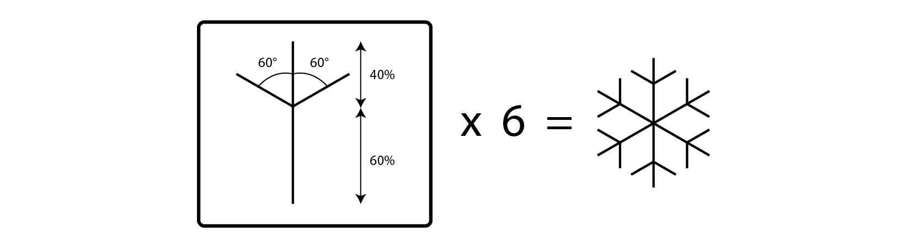

# Python mit Turtle lernen

**Kursbeschreibung:**

Mit dem Python-Modul "Turtle" lernt ihr die Grundlagen der Programmiersprache Python. 
Die Schildkröten aus dem "Turtle"-Modul helfen uns dabei Bilder zu malen. 
Nach euren ersten selbst gemalten Bildern wollen wir zusammen das Spiel "Turtle Race" programmieren. 
Anschließend könnt ihr das Spiel nach euren Vorstellungen noch beliebig erweitern.

**Voraussetzungen:**

Account auf repl.it

**Dokumentation:**

[https://docs.python.org/3/library/turtle.html](https://docs.python.org/3/library/turtle.html)


## 1. Schildkröte erstellen

Bevor wir loslegen, müssen wir noch auf [https://repl.it](https://repl.it) ein neues *repl* erstellen. 
Als Sprache muss "Python (with Turtle)" ausgewählt werden.

Als erstes importieren wir das Turtle-Modul. Mit ```tina = turtle.Turtle()``` 
erstellen wir eine neue Schildkröte names Tina. 

Zum Anzeigen nutzen wir die Funktionen ```shape()``` und ```color()```. 
Zwischen den runden Klammern können wir Funktionen Parameter übergeben, 
wie z.B. die Farbe der Schildkröte, wenn wir die ```color()```-Funktion 
zum Ändern der Farbe aufrufen.

```python
import turtle
tina = turtle.Turtle()
tina.shape("turtle") # "arrow", "turtle", "circle", "square", "classic"
tina.color("green") # black, red, green, yellow, pink ...
```

*TIPP: Du kannst deinen Code mit Kommentaren und Anmerkungen ergänzen. 
Python ignoriert diese Kommentare und führt den auskommentierten Code 
nicht aus. Mit ```#``` kannst du eine Zeile auskommentieren. 
Alles was nach dem ```#```-Zeichen folgt wird von Python ignoriert.*

## 2. Schildkröte bewegen

### Die 4 Basisfunktionen zum bewegen der Schildkröte

Nachfolgend einige Funktionen für das Bewegen der Schildkröte. 

```python
tina.forward(100) # Bewegung nach vorne um 100 Einheiten
tina.backward(100)  # Bewegung nach hinten um 100 Einheiten
tina.left(90) # Drehung nach links um 90 Grad
tina.right(180) # Drehung nach rechts um 180 Grad
```

### >>> Aufgabe: Zeichne ein farbiges Quadrat

Zeichne ein Quadrat, bei dem jede Seite eine eigene Farbe hat. 
Nutze die Befehle ```forward()```  und ```left()```. 
Die Farbe könnt ihr über ```color()``` ändern, in dem ihr in Anführungszeichen 
eine Farbe angibt. Der Farbname wird in Englisch angegeben, z.B. 
```blue```, ```red```, ```green```, ```black```, ```pink```, ```yellow```.

### Das Koordinatensystem

Die Schildkröte befindet sich in einem Koordinaten System. 
Am Anfang ist die Schildkröte auf der Position (x=0 und y=0). 
Mit dem Befehl ```goto(x,y)``` kann die Schildkröte direkt zu einem Punkt 
im Koordinatensystem bewegt werden.

```python
tina.goto(100,100) # tina.goto(x, y)
```

### >>> Aufgabe: Das Haus vom Nikolaus

Zeichne das Haus vom Nikolaus. Verwende dazu den Befehl ```goto(x,y)```.

*TIPP: Zeichne zuerst das Haus vom Nikolaus auf Papier auf und überlege dir, 
welche Koordinaten die fünf Eckpunkte haben.*

### Kreise zeichnen

Mit dem Befehl ```circle()``` kannst du Kreise zeichnen. 
Verwende ```circle(radius)``` um einen Kreis mit einem bestimmten 
Radius zu zeichnen.  Mit ```circle(radius, angle)``` kannst du 
einen Kreis mit Radius ```radius``` und einem Winkel ```angle``` zeichnen. 
Mit einem Winkel von 180 Grad lässt sich beispielsweise ein Halbkreis zeichnen.

### Schildkröte ohne zu zeichnen bewegen

Die Schildkröte kann auch ohne zu zeichnen bewegt werden. 
Mit ```penup()``` hebst du den Stift der Schildkröte. 
Die Schildkröte zeichnet nun solange nicht mehr, bis du ihr 
wieder den Befehl ```pendown()``` zum senken des Stifts gibst. 

### >>> Aufgabe: Zeichne einen Smiley

Zeichne mit dem Befehl ```circle(radius)``` einen Smiley. 
Verwende dazu einen großen Kreis für das Gesicht und 
einen mittleren für den Mund und zwei kleine Kreise für die Augen. 
Um zwischen den einzelnen Kreisen keine Linie zu malen, verwende den 
Befehl ```penup()``` und ```pendown()```.

*TIPP: Wenn du möchtest kannst du für den Mund auch einen Halbkreis zeichnen. 
Verwende dazu den Befehl ```circle(radius, angle)```. Für einen Halbkreis 
musst du den ```angle``` auf 180 Grad setzen.*

## 3. Variablen

In Variablen können Zahlen und Texte gespeichert werden. Zahlen können einfach 
so geschrieben werden. Texte müssen aber immer zwischen Anführungszeichen stehen.

```python
square_size = 10 # in der Variable wird die Zahl 10 gespeichert
square_color = "blue" # in der Variable wird der Text "blue" gespeichert
```

### >>> Aufgabe: Variablen verwenden

Zeichne ein Quadrat. Speichere die Kantenlänge und den Winkel in Variablen ab. 
Verwende anschließend bei ```forward()``` und ```left()``` die zuvor definierten Variablen. 

Der Vorteil von Variablen ist, dass du nur eine Zahl ändern musst, 
um z. B. die Länge aller Kanten des Quadrants anzupassen.

Versuche auch mit den Variablen zu rechnen. Mache aus dem Quadrat ein Rechteck, 
indem du die obere und die untere Kante mal zwei nimmst.

## 4. Schleifen

Mit Schleifen kannst du Befehle mehrmals ausführen. Das nachfolgende Code-Beispiel 
zeichnet ein Quadrat. Anstatt für jede Seite die Befehle ```forward(50)``` 
und ```left(90)``` erneut zu schreiben, kann mit einer Schleife der Code 
vereinfacht werden. Die Zeilen 2-3 zeichnen eine Seite und die erste Zeile 
mit dem Schlüsselwort ```for``` gibt an, dass die Schleife insgesamt vier 
mal (```range(4)```) ausgeführt wird. 

```python
for count in range(4):
    tina.forward(50)
    tina.left(90)
```

Zwischen ```for``` und ```in range()``` steht die Variable für den Zähler. 
Die Variable (im obigen Beispiel ```count```) enthält die Nummer des aktuellen Durchlaufs. 
Die Variable enthält während den vier Durchläufen der Reihe nach die Zahlen 0, 1, 2 und 3. 

Im nachfolgenden Beispiel wird die Zählervariable verwendet. In Zeile 2 wird ```count``` 
in jedem Durchlauf mit 2 multipliziert. Die Schildkröte läuft somit im

1. Durchlauf: count=0 => count\*2 = 0
2. Durchlauf: count=1 => count\*2 = 2
3. Durchlauf: count=2 => count\*2 = 4
4. Durchlauf: count=3 => count\*2 = 6

```python
for count in range(100):
  tina.forward(count*2) 
  tina.left(60)
```

*TIPP: Für eine detailierte Dokumentation zu ```range()``` 
siehe [https://docs.python.org/3/library/stdtypes.html#typesseq-range](https://docs.python.org/3/library/stdtypes.html#typesseq-range). 
Hier werden auch noch weitere Varianten von ```range()``` erklärt.*

### >>> Aufgabe: Schleifen verwenden

Lass die Schildkröte im Kreis laufen. Vergrößere bei jedem Durchlauf der 
Schleife die Strecke, die die Schildkröte zurück legt. Am Ende von jedem 
Durchlauf soll sich die Schildkröte um einen beliebigen Wert nach links drehen. 
Spiele beliebig mit den Werten und vergrößere auch die Anzahl der Schleifendurchläufe.

*TIPP: Du kannst die Schildkröte auch schneller laufen lassen, dann 
musst du bei vielen Schleifendurchläufen nicht so lange warten. 
Verändere die Geschwindigkeit der Schildkröte mit ```speed()```. 
Mit ```tina.speed("fastest")``` läuft die Schildkröte Tina so schnell sie kann.*

### >>> Aufgabe: Schneeflocke mit Schleife malen

Male eine Schneeflocke. Überlege dir, wie die Schneeflocke aufgebaut ist. 
Zeichne einen Teil der Schneeflocke und lass diesen Teil mit der Schleife 
weitere 6 mal zeichnen. Nutze Variablen, mit den du rechnen kannst. 
Als Winkel kannst du 60 Grad verwenden.



### >>> Aufgabe: Drehende Formen

Lass die Schildkröte im Abstand von 10° Grad im Kreis drehen. Vor jeder 
Drehung wird ein Kreis oder ein Quadrat gemalt. Wenn du möchtest kannst 
du die Formen auch bei jeder Drehung etwas größer werden lassen.

## 5. Listen

In Listen können mehrere Werte gespeichert werden. Die Elemente einer 
Liste werden mit Komma getrennt zwischen eckigen Klammern gespeichert.

```python
colors = ['red', 'purple', 'blue', 'green']
```

Mit ```colors[i]``` kann auf das (i+1)-te Element zugegriffen werden. 
Wichtig: Die Zählung beginnt nicht bei Eins sondern bei Null. 
Auf das erste Element greift ihr somit mit ```colors[0]``` zu und auf das 
zweite Element mit  ```colors[1]```.

Um zu wissen, wie viele Elemente in einer Liste sind, bzw. wie lang eine Liste ist, 
könnt ihr ```len()``` verwenden. Im nachfolgenden Beispiel 
wird in der Variable ```colors_size``` die Länge 
der Liste ```colors```, hier 4, gespeichert. Anschließend wird die ```for```-Schleife 
4 mal durchlaufen. Bei jedem Durchlauf wird eine andere Farbe aus der Liste ausgewählt.

```python
# Quadrat, bei dem jede Seite eine andere Farbe hat
colors = ['red', 'purple', 'blue', 'green']
colors_size = len(colors) # len(colors) => 4
for i in range(colors_size): 
    tina.color(colors[i]) 
    tina.forward(100) 
    tina.left(90) 
```

### >>> Aufgabe: Hexagon (Sechseck) zeichnen

Zeichne ein Sechseck, bei dem jede Seite eine andere Farbe besitzt. 
Alle sechs Seiten sollen gleich lang und alle Winkel gleich groß sein.

Verwende zum zeichnen die ```for```-Schleife und eine Liste mit den Farbnamen. 

## 6. Funktionen

Funktionen erleichtern euch die Arbeit. Wenn bestimmte Teile in eurem Programm 
mehrmals Vorkommen, könnt ihr diese in eine Funktion auslagern. 

Ihr habt bereits schon unbewusst Funktionen verwendet. Es gibt z. B. die Funktion 
```circle()```, die Kreise malt. Wir möchten nun selber eine Funktion schreiben, die Quadrate malt.

Mit ```def``` beginnt die Definition einer Funktion, gefolgt vom Namen und einem Doppelpunkt. 
Alles was danach um einen oder mehr Tabs eingerückt ist, gehört zu dieser Funktion.

```python
# Funktion, die Quadrate mit der Seitenlänge 50 zeichnet
def square():
  for count in range(4):
    tina.forward(50)
    tina.left(90)
```

### Funktionen mit Parametern

Mit der obigen Funktion können wir nur Quadrate in einer bestimmten Größe zeichnen. 
Mit Parametern können wir die Funktion noch etwas flexibler gestalten. 
Wir können in der Funktion einen Parameter für die Größe des Quadrats festlegen.

```python
# Funktion, die Quadrate unterschiedlicher Seitenlänge zeichnet
def square(size):
  for count in range(4):
    tina.forward(size)
    tina.left(90)
```

Mit ```square(100)``` rufen wir die obige Funktion auf und es wird ein Quadrat 
mit der Seitenlänge 100 gezeichnet. Mit ```square(50)``` ein Quadrat mit Seitenlänge 50.

### >>> Aufgabe: Funktion für Dreiecke

Schreibe eine Funktion ```triangels(size)```, die gleichseitige Dreiecke mit 
beliebiger Seitenlänge zeichnen kann. Bei gleichseitigen Dreiecken sind alle 
Seiten gleich lang und alle Winkel 60° groß.

*TIPP: Bewege die Schildkröte mit ```left()``` und ```forward()```, anstatt mit ```goto()```.*

### >>> Aufgabe: Spinnennetz

Schreibe eine Funktion ```draw_six_triangles(size)```, die sechs mal ```triangles(size)``` aufruft. 
Nach jedem gezeichneten Dreieck dreht sich die Schildkröte um 60°.

Wenn du nun ```draw_six_triangles(size)``` nacheinander mit verschiedenen Werten aufrufst, 
z.B. mit 25, 50, 100 und 150 erhälst du einen Spinnennetz.

*TIPP: Du kannst die Schildkröte mit ```tina.speed("fastest")``` auch schneller laufen lassen.*

## 7. Turtle Race (Das Schildkröten-Rennen)

Wir möchten nun gemeinsam das Spiel "Turtle Race" programmieren. Bei diesem Spiel 
starten mehrere Schildkröten gleichzeitig von der Startlinie. Die Schildkröten bewegen 
sich abwechselnd immer um einen zufälligen Wert nach vorne. Die Schildkröte, 
die als erstes die Ziellinie erreicht hat gewonnen.

Für das Spiel brauchen wir:

* Skala von 0 bis 20 am oberen Rand des Spielfelds
* mehrere unterschiedlich farbige Schildkröten
* Funktion zur Generierung von Zufallszahlen

Jedes der Spielelemente wird in eine eigene Funktionen auslagert. Nachfolgend schreiben wir 
nun die notwendigen Funktionen und setzen Schritt für Schritt das Spiel zusammen.

### >>> Aufgabe 1: Skala am oberen Spielfeldrand

Schreibe eine Funktion ```draw_scala(size)```, die in einer ```for```-Schleife die Zahlen 
von 0 bis 20 schreibt. Zwischen jeder Zahl ist ein Abstand von 20.

Für das Schreiben von Texten kannst du ```tina.write(text, align="center")``` verwenden. 
Ersetze ```text``` durch die von dir verwendete Zählervariable in der ```for```-Schleife.

Setze die Schildkröte vor dem Aufruf der Funktion ```draw_scala(20)``` auf die 
Position x=-200 und y=200. Nach dem die Skala gezeichnet wurde, setzt du die 
Schildkröte wieder auf x=0 und y=0.

### >>> Aufgabe 2: Mehrere Schildkröten erstellen

Erstelle drei neue Schildkröten, die am Rennen teilnehmen. Gib jeder Schildkröte einer andere Farbe.

Mit ```turtle.Turtle()``` kannst du eine neue Schildkröte erstellen. Achte darauf, 
dass jede der drei Schildkröten einen eigenen Namen hat.

```python
tina = turtle.Turtle() # neue Schildkröte erstellen
```

Setze die Schildkröten auf die Startpositionen bei (x=-200,y=160), (x=-200,y=100) 
und (x=-200,y=40). Achte darauf, beim Verschieben mit ```goto()``` zuvor den Stift 
anzuheben und anschließend den Stift wieder zu senken.

### >>> Aufgabe 3: Schildkröten um Zufallswert bewegen

In einer Schleife, die wir 150 mal durchlaufen, lassen wir nun die Schildkröten 
um einen Zufallswert zwischen 1 und 5 nach vorne bewegen.

Zufallswerte können mit ```randint(a,b)``` erstellt werden.  ```a``` ist die untere 
Grenze und ```b```  die obere Grenze zwischen denen der Zufallswert liegen soll. 
Für unser Spiel brauchen wir somit ```randint(1,5)```.

Weil ```randint(a,b)``` nicht standardmäßig vorhanden ist, müssen wir es erst mit der 
folgenden Zeile importieren:

```python
from random import randint
```

Du hast nun die erste einfache Version des Spiels fertig. Starte das Programm 
und schaue welche Schildkröte am Ende vorne liegt.

### >>> Aufgabe 4: Horizontale Linien zeichnen

Schreibe eine Funktion ```draw_horizontal_lines()```, die horizontale Linien zeichnet. 
Die horizontalen Linien werden bei x=-200 und y=190 direkt unter die Zahlenskala 
aus Aufgabe 1 gezeichnet. Die Höhe einer Linie beträgt 190.

Nutze für das Zeichnen der Linien eine ```for```-Schleife. Der Einfachheit 
halber kannst du in einem Schleifendurchlauf 190 runterlaufen und anschließend 
auf der selben Linie 190 wieder hochlaufen. Zwischen den einzelnen 
horizontalen Linien ist wie bei der Zahlen-Skala ein Abstand von 20.

*WICHTIG: Der Aufruf der Funktion muss vor der Schleife aus Aufgabe 3 stehen, 
in der sich die Schildkröten über das Spielfeld in Richtung Ziel bewegen.*

### >>> Aufgabe 5: Name der Gewinner-Schildkröte ausgeben

**ACHTUNG: ```if```-statement sollte vor der Aufgabe kurz erklärt werden**

Um in Python zu überprüfen, ob Wert A größer als Wert B ist, gibt es ```if```-Anweisungen. 
Schreibe das nachfolgende Beispiel ab und schau welcher Text ausgegeben wird. 
Ändere den Wert ```a``` auf 10 und schau wie sich die Textausgabe verändert. 

Probiere statt "Größer" ```>``` und "Kleiner" ```<``` auch "Größer gleich" ```>=``` 
und "Kleiner gleich" ```<=``` aus.

```python
a = 5
b = 9

if a > b :
  print("a ist größer als b")
if a < b :
  print("a ist kleiner als b")  
```


Wir möchten nun den Namen der Schildkröte ausgeben, die als erstes die Ziellinie erreicht. 
Dazu erweitern wir die ```for```-Schleife aus Aufgabe 3 und packen diese 
in die Funktion ```start_race()```.

Nachdem sich eine Schildkröte fortbewegt hat, überprüfen wir jedes Mal, 
ob die Schildkröte bereits die Ziellinie erreicht hat. 

Wir wissen, dass die Zielline bei x=200 liegt. Die aktuelle Position einer Schildkröte 
auf der x-Achse können wir mit ```xcor()``` abfragen. Wenn wir nun nach 
jedem mal ```forward()``` abfragen, ob die x-Koordinate der Schildkröte größer als 
die x-Koordinate der Ziellinie ist, wissen wir wann die Schildkröte über der Ziellinie ist. 
In der  ```if```-Abfrage geben wir mit ```print("XYZ hat gewonnen!")``` den Namen der 
Gewinner-Schildkröte aus.

Füge die gerade eben erstellte ```if```-Abfrage nach jedem ```forward()``` von 
den 3 Schildkröten ein. Damit die Schildkröten nicht weiterlaufen, müssen wir 
die ```start_race```-Funktion verlassen. Füge hierzu noch jeweils an das Ende der 
drei ```if```-Anweisungen ein ```return```.

Nun fehlt nur noch der Aufruf der Funktion ```start_race()```. 

### Erweiterungen für das Spiel

* Zur Ausgabe der Schildkrötennamen eine Liste verwenden
* karierte Ziellinie malen. Verwende dazu Quadrate, die du abwechselnd füllst, 
bzw. nicht füllst (```begin_fill```, ```end_fill``` und ```if i % 2 == 0```)
* Wetten auf Schildkröten abschließen (```input()```, ```and```, ```or```)
* Platzierung aller Schildkröten anzeigen (1. Platz, 2. Platz, ...)
* Countdown anzeigen, bevor das Rennen startet (3, 2, 1, START)